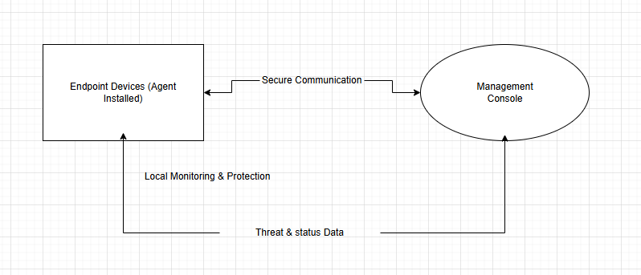

# SentinelEdge Endpoint Security – Architecture Overview

## Objective

This document explains the **high-level architecture** of SentinelEdge Endpoint Security and how its core components work together to protect endpoint devices. It focuses on **conceptual understanding** rather than technical implementation details.

The goal is to help readers understand *what each component does*, *how they communicate*, and *how data flows through the system* to deliver effective endpoint protection.

---

## Intended Audience

This document is written for:

* **IT administrators** responsible for deploying and managing endpoint protection
* **Security engineers** who need to understand how SentinelEdge components interact

Readers are expected to have general IT knowledge but do not need in-depth familiarity with SentinelEdge internals.

---

## High-Level Architecture Overview

SentinelEdge Endpoint Security uses a **centralized management architecture** with lightweight protection agents deployed on endpoints. These agents communicate with a central management console that provides visibility, control, and coordination.

At a high level, the architecture consists of:

* Endpoint agents installed on protected devices
* A central management console
* Secure communication channels between components
  nTogether, these components enable continuous monitoring, threat detection, and coordinated response across all endpoints.

---

## Architecture Diagram (Conceptual)

*This diagram represents a simplified view of SentinelEdge’s architecture and does not include implementation-specific details.*

---

## Endpoint Agent Role

The **SentinelEdge endpoint agent** is installed on each protected device, such as laptops, desktops, or servers. The agent is responsible for enforcing security directly on the endpoint.

Key responsibilities of the endpoint agent include:

* Continuously monitoring processes, files, and system activity
* Detecting malicious or suspicious behavior
* Blocking threats in real time to prevent damage
* Reporting security events and endpoint status to the management console

The agent operates locally on the endpoint, allowing it to respond immediately to threats even when network connectivity is limited.

---

## Management Console

The **management console** serves as the centralized control and visibility point for SentinelEdge Endpoint Security. It allows administrators and security teams to oversee endpoint protection across the organization.

Key functions of the management console include:

* Displaying the security status of all protected endpoints
* Collecting threat and activity data from endpoint agents
* Providing alerts and summaries of detected threats
* Enabling high-level policy management and response actions

By centralizing visibility and control, the management console helps ensure consistent protection and informed decision-making.

---

## Communication Flow

Communication between endpoint agents and the management console follows a secure, controlled flow:

1. Endpoint agents monitor local activity and enforce protection
2. Agents send status updates and threat information to the management console
3. The management console processes and aggregates data from multiple endpoints
4. High-level instructions or policy updates are sent back to endpoint agents as needed

This bidirectional communication ensures that endpoints remain protected while allowing centralized oversight.

---

## High-Level Data Flow

The flow of data within SentinelEdge Endpoint Security can be summarized as follows:

* **Endpoint activity data** is generated locally by the agent
* **Threat-related events** are identified and handled on the endpoint
* **Summary and status data** is transmitted to the management console
* **Administrative insights** are derived from aggregated endpoint data

Sensitive processing and enforcement occur on the endpoint itself, while the management console focuses on visibility, coordination, and reporting.

---

## What This Document Does Not Cover

This architecture overview intentionally excludes:

* Low-level implementation or code details
* Internal algorithms or detection logic
* Deployment-specific configurations

These topics are addressed in separate technical and administrative documents.

---

## Summary

SentinelEdge Endpoint Security uses a centralized architecture with distributed endpoint agents to deliver effective protection against modern threats. Endpoint agents provide real-time, local enforcement, while the management console offers centralized visibility and control.

This high-level architecture enables scalable, consistent, and proactive endpoint security across an organization.
